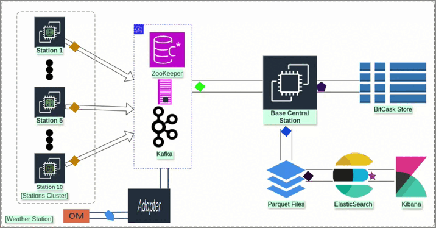
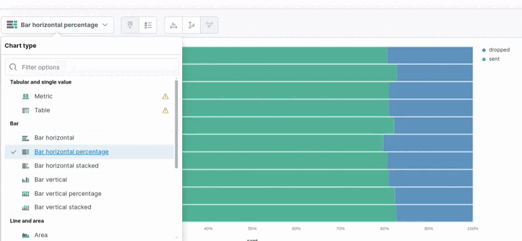

# Weather-Stations_Monitoring

This project integrates weather data from local weather stations and the Open-Meteo API, processes the data using Apache Kafka, and stores it in Elasticsearch for analysis. The project includes several components, including producers, consumers, and an uploader that watches for new data files and uploads them to Elasticsearch.




## Project Structure

- `KAFKA/`: Contains the Kafka producer code.
- `central_station/`: Contains the central station consumer code.
- `ELK/`: Contains the uploader code and Dockerfile for Elasticsearch, Logstash, and Kibana.
- `K8S/`: Contains Kubernetes deployment files for Kafka, producers, central station, and ELK stack.
-  `Streaming/`: Contains the  processing streaming  code.
- `system.sh`: Shell script to build, deploy, and manage the system.

## Prerequisites

- Docker
- Kubernetes (Minikube or Kind)
- Apache Kafka
- Maven
- Java
- Elasticsearch
- Python

## Setup and Deployment

### Build and Deploy the System

1. Clone the repository:

   ```bash
   git clone [https://github.com/Mahmoud-Mohammed-Fathallah/Weather-Stations_Monitoring.git]
   cd Weather-Stations_Monitoring
   ```

2. Run the system setup script:

   ```bash
   ./system.sh up
   ```

   This script performs the following steps:
   - Builds the Docker images for the producer, central station, and uploader.
   - Deploys Kafka, storage, producers, central station, uploader, and the ELK stack to Kubernetes.

3. Optionally, you can skip building the JARs and Docker images:

   ```bash
   ./system.sh up njar
   ./system.sh up njar nbuild
   ```

### Shut Down the System

To bring down the system:

```bash
./system.sh down
```

## Scripts

### `system.sh`

This script manages the build and deployment of the system. It supports the following commands:

- `up`: Builds and deploys the system.
- `up njar`: Deploys the system without building the JAR files.
- `up njar nbuild`: Deploys the system without building the JAR files or Docker images.
- `down`: Shuts down and cleans up the deployed system.

## Docker Images

- **Producer Image**: Built from the `KAFKA/` directory.
- **Central Station Image**: Built from the `central_station/` directory.
- **Uploader Image**: Built from the `ELK/` directory.

## Kubernetes

- **Kafka**: Deploys Kafka using `kafka.yml`.
- **Storage**: Deploys storage services using `storage.yml`.
- **Producers**: Deploys multiple producer instances using `run10.sh`.
- **Central Station**: Deploys the central station consumer using `central_station.yml`.
- **Uploader**: Deploys the uploader using `upload_parquets.yml`.
- **ELK Stack**: Deploys Elasticsearch, and Kibana using `Elk.yml`.

## Integration Patterns

This project implements several Enterprise Integration Patterns:

1. **Polling Consumer**: The producers poll weather data from local stations and the Open-Meteo API.
2. **Dead-Letter Channel**: Handles failed message processing.
   ---------------not finshed-------------------------------------------
4. **Channel Adapter**: Integrates external weather data sources into the Kafka message system.
5. **Idempotent Receiver**: Ensures that messages are processed exactly once.
6. **Envelope Wrapper**: Encapsulates messages with metadata for routing and processing.
7. **Claim Check**: Offloads large message payloads and retains a reference in Kafka messages.

## Environment Variables

- `ELASTICSEARCH_URL`: URL of the Elasticsearch instance.
- `ELASTICSEARCH_INDEX`: Name of the Elasticsearch index to store weather data.
- `DATA_PATH`: Path to the directory where data files are stored.

## Logging

Logs are written to `app.log` using the `logging` module for .
## kibana results 



## Observing File Changes

The uploader component uses the `watchdog` library to monitor the specified directory for changes and upload new or modified Parquet files to Elasticsearch.

## Contributing

Contributions are welcome! Please fork the repository and create a pull request with your changes.

## License

This project is licensed under the MIT License. See the LICENSE file for details.

## Contact

For any questions or issues, please contact mAm.

---

By mAm

---

