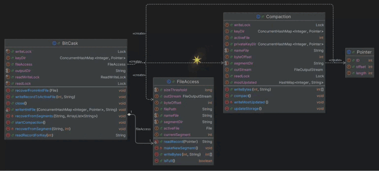
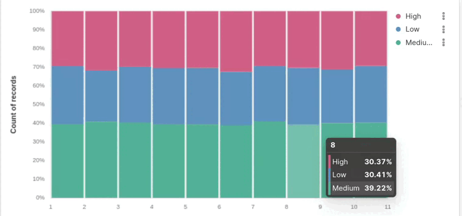
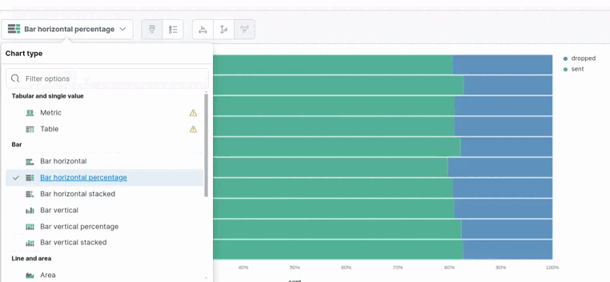

# Weather-Stations_Monitoring

This project integrates weather data from local weather stations and the Open-Meteo API, processes the data using Apache Kafka, and stores it in Elasticsearch for analysis. The project includes several components, including producers, consumers, and an uploader that watches for new data files and uploads them to Elasticsearch.


## Project Structure

- `KAFKA/`: Contains the Kafka producer code.
- `central_station/`: Contains the central station consumer code.
- `ELK/`: Contains the uploader code and Dockerfile for Elasticsearch, Logstash, and Kibana.
- `K8S/`: Contains Kubernetes deployment files for Kafka, producers, central station, and ELK stack.
- `Streaming/`: Contains the processing streaming code.
- `RemoteApi/`: Contains code for integrating with the remote Open-Meteo API.
- `Logs/`: Directory to store logs.
- `system.sh`: Shell script to build, deploy, and manage the system.

## Prerequisites

- Docker
- Kubernetes (Minikube or Kind)
- Apache Kafka
- Maven
- Java
- Elasticsearch
- Python

## Setup and Deployment

### Build and Deploy the System

1. Clone the repository:

   ```bash
   git clone [https://github.com/Mahmoud-Mohammed-Fathallah/Weather-Stations_Monitoring.git]
   cd Weather-Stations_Monitoring
   ```

2. Run the system setup script:

   ```bash
   ./system.sh up
   ```

   This script performs the following steps:
   - Builds the Docker images for the producers, central station, and uploader.
   - Deploys Kafka, storage, producers,remote api, central station, uploader, and the ELK stack to Kubernetes.

3. Optionally, you can skip building the JARs and Docker images:

   ```bash
   ./system.sh up njar
   ./system.sh up njar nbuild
   ```

### Shut Down the System

To bring down the system:

```bash
./system.sh down
```

## Scripts

### `system.sh`

This script manages the build and deployment of the system. It supports the following commands:

- `up`: Builds and deploys the system.
- `up njar`: Deploys the system without building the JAR files.
- `up njar nbuild`: Deploys the system without building the JAR files or Docker images.
- `down`: Shuts down and cleans up the deployed system.


## Kubernetes

 - `central_station.yml`: Deployment file for central station.
  - `Elk.yml`: Deployment file for Elasticsearch, Logstash, and Kibana stack.
  - `KafkaProcessor.yml`: Deployment file for Kafka stream processor.
  - `kafka.yml`: Deployment file for Kafka.
  - `meto_station.yml`: Deployment file for meto station.
  - `run10.sh`: Script to deploy ten producers.
  - `stop10.sh`: Script to stop ten producers.
  - `storage.yml`: Deployment file for storage.
  - `ten_weather_stations.yml`: Deployment file for ten weather stations.
  - `upload_parquets.yml`: Deployment file for uploader.
  - `weather_station.yml`: Deployment file for weather station.

## Integration Patterns

This project implements several Enterprise Integration Patterns:

1. **Polling Consumer**: The central station poll weather data from local stations and the Open-Meteo API.
2. **Dead-Letter Channel**: Handles failed message processing by putting in another Topic.
3. **Channel Adapter**: Integrates external weather data sources into the Kafka message system.
4. **Envelope Wrapper**: Encapsulates messages with metadata for routing and processing.
   
### Bitcask Usage in Weather Stations Monitoring Project
  
- **Efficient Data Storage**: Uses Bitcask's log-structured storage for high-performance write operations.
- **Quick Data Retrieval**: In-memory index allows for rapid access to historical weather data.
- **Optimal Disk Usage**: Compaction process removes outdated entries, maintaining efficient storage.
- **Reliability**: Ensures quick and reliable recording of data from various weather stations.
- 


## kibana results 




## Observing File Changes

The uploader component uses the `watchdog` library to monitor the specified directory for changes and upload new or modified Parquet files to Elasticsearch.

## Contributing

Contributions are welcome! Please fork the repository and create a pull request with your changes.

## License

This project is licensed under the MIT License. See the LICENSE file for details.

## Contact

For any questions or issues, please contact mAm.

---

By mAm

---

